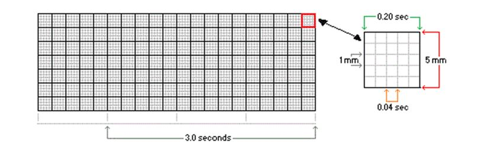
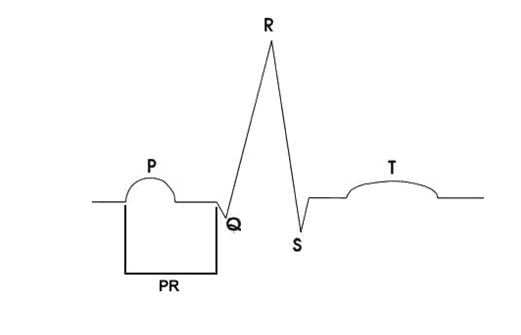
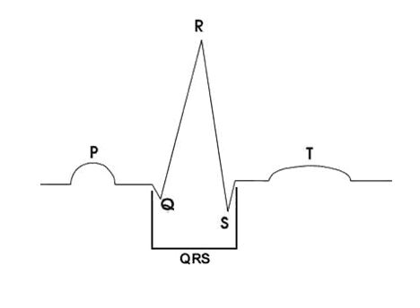
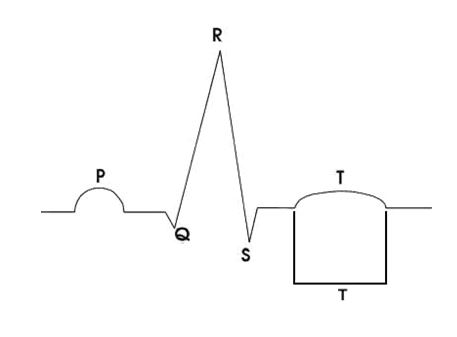
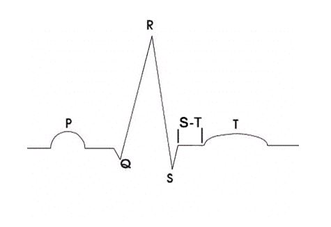
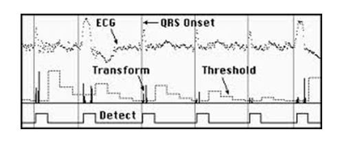
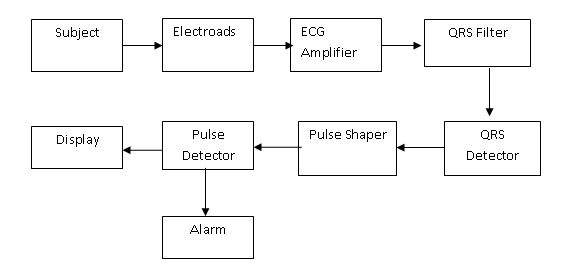
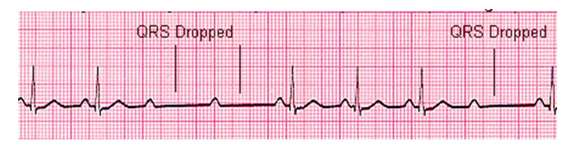
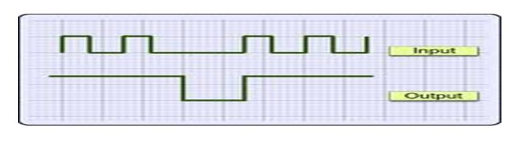

### Theory

The electrocardiogram (ECG) is a diagnostic tool that measures and records the electrical activity of the heart in detail. Being able to interpretate these details allows diagnosis of a wide range of heart problems.

ECG Interpretation

The graph paper that the ECG records on is standardized to run at 25mm/second, and is marked at 1 second intervals on the top and bottom. The horizontal axis correlates the length of each electrical event with its duration in time. Each small block (defined by lighter lines) on the horizontal axis represents 0.04 seconds. Five small blocks (shown by heavy lines) is a large block, and represents 0.20 seconds.

Duration of a waveform, segment, or interval is determined by counting the blocks from the beginning to the end of the wave, segment, or interval.
P-Wave: represents atrial depolarization - the time necessary for an electrical impulse from the sinoatrial (SA) node to spread throughout the atrial musculature.

        * Location: Precedes QRS complex
         Amplitude: Should not exceed 2 to 2.5 mm in height Duration: 0.06 to 0.11 seconds
		 
P-R Interval: represents the time it takes an impulse to travel from the atria through the AV node, bundle of His, and bundle branches to the Purkinje fibres.
        * Location: Extends from the beginning of the P wave to the beginning of the QRS complex
         Duration: 0.12 to 0.20 seconds.
		 

		 
QRS Complex: represents ventricular depolarization. The QRS complex consists of 3 waves: the Q wave, the R wave, and the S wave.
* The Q wave is always located at the beginning of the QRS complex.
    It may or may not always be present.
    The R wave is always the first positive deflection.
    The S wave, the negative deflection, follows the R wave

* Location: Follows the P-R interval
    Amplitude: Normal values vary with age and sex
    Duration: No longer than 0.10 seconds

Q-T Interval: represents the time necessary for ventricular depolarization and repolarization.
* Location: Extends from the beginning of the QRS complex to the end of the T wave
    (includes the QRS complex, S-T segment, and the T wave)
    Duration: Varies according to age, sex, and heart rate
T Wave: represents the depolarization of the ventricles. On rare occasions, a U wave can be seen following the T wave. The U wave reflects the depolarization of the His-Purkinje fibers
* Location: Follows the S wave and the S-T segment
    Amplitude: 5mm or less in standard leads I, II, and III; 10mm or less in precordial leads V1-V6.
    Duration: Not usually measured
	

S-T Segment: represents the end of the ventricular depolarization and the beginning of ventricular repolarization.

* Location: Extends from the end of the S wave to the beginning of the T wave
Duration: Not usually measured

QRS detector:

There are several applications which require an accurate detection of the QRS complex of the ECG. For example, arrhythmia monitors for ambulatory patients analyze the ECG in real time and when an arrhythmia occurs, the monitor stores a time segment of the abnormal ECG. This kind of monitor requires an accurate QRS recognition capability. Thus, QRS detection is an important part of many ECG signal processing systems.

Figure below show detection of QRS waves.

Figure Below show the block Diagram of QRS Detector:

Pulse missing detector:

When electrical excitation sometimes fails to pass through the A-V node or bundle of His, this intermittent occurance is said to be called second degree heart block. Electrical conduction usually has a constant P-R interval, in the case of type 2 block atrial contractions are not regularly followed by ventricular contraction

Looking at the ECG you'll see that:
* Rhythm - Regular
* Rate - Normal or Slow
* QRS Duration - Prolonged
* P Wave - Ratio 2:1, 3:1
* P Wave rate - Normal but faster than QRS rate
* P-R Interval - Normal or prolonged but constant

Figure below show some missed QRS waves which can be detected by pulse missing detector which generate trigger pulse which indicate presence of arrhythmia and buzz the alarm.

